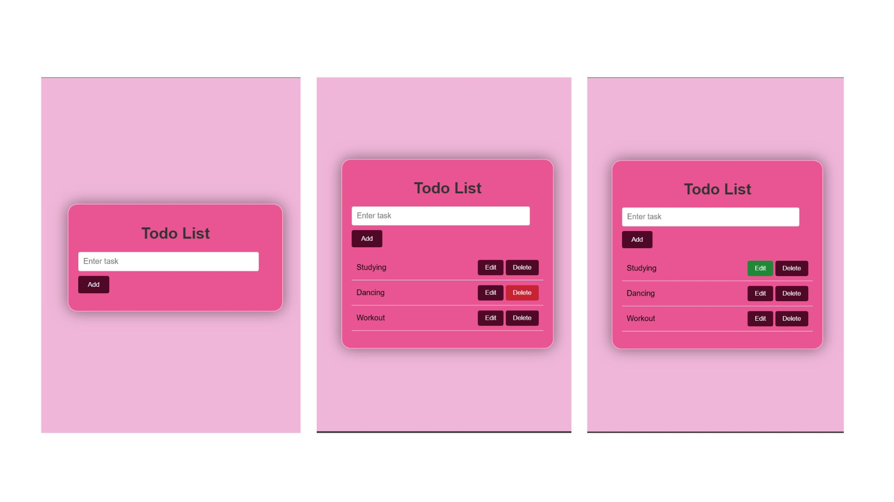

# Todo List Web Application

This is a simple web application for managing your todo list. You can add tasks, edit existing tasks, and delete tasks as needed.

## Screenshot

## Features

- **Add tasks**: Enter a task in the input field and click "Add" to add it to the list.
- **Edit tasks**: Click the "Edit" button next to a task to edit its text.
- **Delete tasks**: Click the "Delete" button next to a task to remove it from the list.

## Technologies Used

- **HTML**: Markup language for structuring the web page.
- **CSS**: Styling language for designing the appearance of the web page.
- **JavaScript**: Programming language for adding interactivity to the web page.

## How to Use

1. Clone the repository to your local machine.
2. Open the index.html file in your web browser.
3. Start adding, editing, and deleting tasks using the provided interface.

